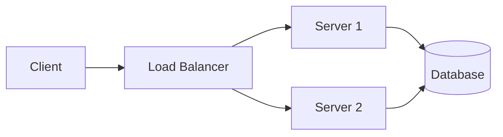
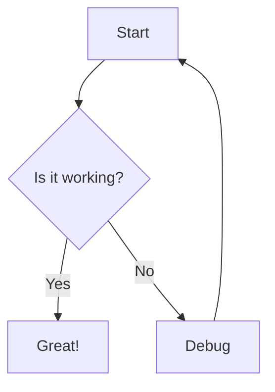

# Maidy

A fast CLI tool built with Bun to render Mermaid diagrams to SVG or ASCII, and convert Markdown documents with embedded Mermaid diagrams to HTML using [beautiful-mermaid](https://github.com/lukilabs/beautiful-mermaid).

## Installation

```bash
bun install
```

## Usage

### Basic Examples

Render a Mermaid file to SVG:
```bash
bun run index.ts -i diagram.mmd -o output.svg
```

Render to ASCII (for terminal display):
```bash
bun run index.ts -i diagram.mmd -f ascii
```

Use stdin/stdout:
```bash
cat diagram.mmd | bun run index.ts -f svg > output.svg
```

### Markdown to HTML

Convert Markdown documents with embedded Mermaid diagrams to HTML:
```bash
bun run index.ts -i document.md -m -o output.html
```

With a custom theme:
```bash
bun run index.ts -i document.md -m -t dracula -o output.html
```

From stdin:
```bash
cat document.md | bun run index.ts -m > output.html
```

#### Example Markdown File

Create a file `example.md`:
````markdown
# My Document

This is a document with an embedded Mermaid diagram.

## System Architecture



The diagram above shows our system architecture.
````

Then convert it to HTML:
```bash
bun run index.ts -i example.md -m -o document.html
```

### Options

- `-i, --input <file>`: Input file containing Mermaid code or Markdown (default: stdin)
- `-o, --output <file>`: Output file (default: stdout)
- `-f, --format <format>`: Output format: `svg`, `ascii`, or `html` (default: svg for diagrams, html for markdown)
- `-m, --markdown`: Markdown mode: convert markdown with mermaid blocks to HTML
- `-t, --theme <theme>`: Theme name for diagrams (default: github-dark)
- `-l, --list-themes`: List available themes
- `-h, --help`: Show help message

### Themes

List all available themes:
```bash
bun run index.ts --list-themes
```

Use a specific theme:
```bash
bun run index.ts -i diagram.mmd -o output.svg -t monokai
```

## Example Mermaid Diagram

Create a file `example.mmd`:


Render it:
```bash
bun run index.ts -i example.mmd -o example.svg
```

## Making it Globally Available

To use the CLI globally, you can link it:
```bash
bun link
```

Then use it anywhere:
```bash
maidy -i diagram.mmd -o output.svg
```

## License

MIT
# maidy
