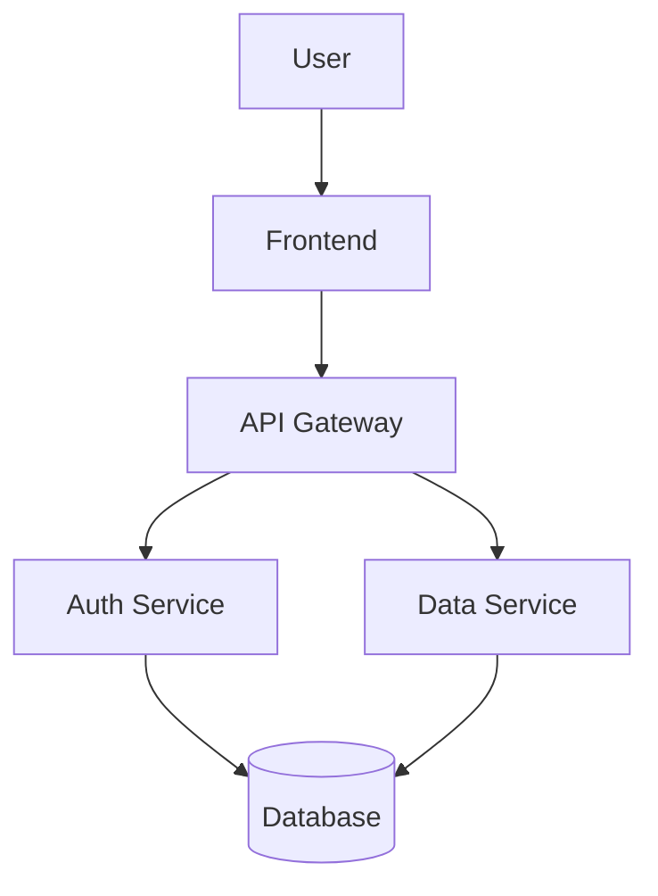
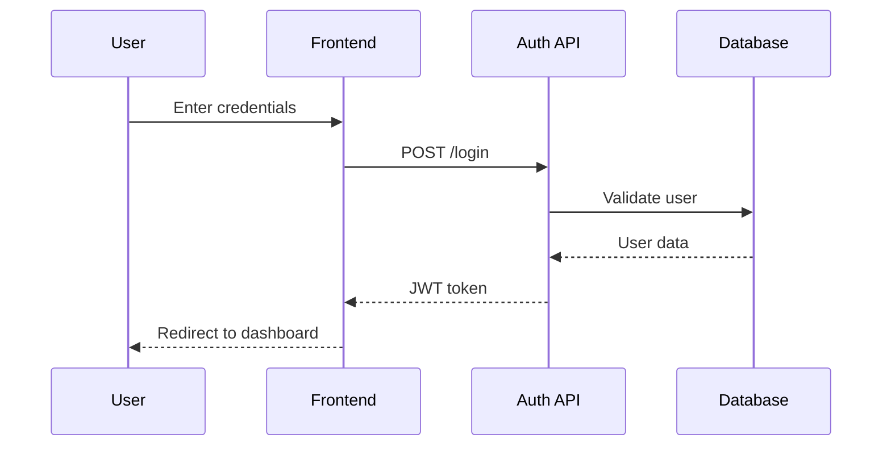
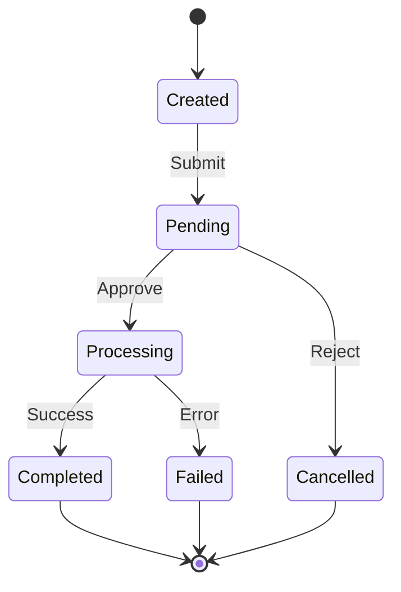

# Sample Document with Mermaid Diagrams

This is a test document to demonstrate markdown-to-PDF conversion with embedded Mermaid diagrams.

## Architecture Overview

Below is a flowchart showing the system architecture:



## Sequence Diagram

Here's a sequence diagram showing the authentication flow:



## Features

The system includes the following features:

- **Authentication**: Secure user login and registration
- **Authorization**: Role-based access control
- **Data Management**: CRUD operations for all entities
- **Real-time Updates**: WebSocket support for live data

## Code Example

Here's a simple example in TypeScript:

```typescript
async function fetchData(id: string): Promise<Data> {
  const response = await fetch(`/api/data/${id}`);
  return response.json();
}
```

## State Diagram

The order processing workflow:



## Conclusion

This demonstrates markdown with multiple mermaid diagrams, text formatting, and code blocks.
